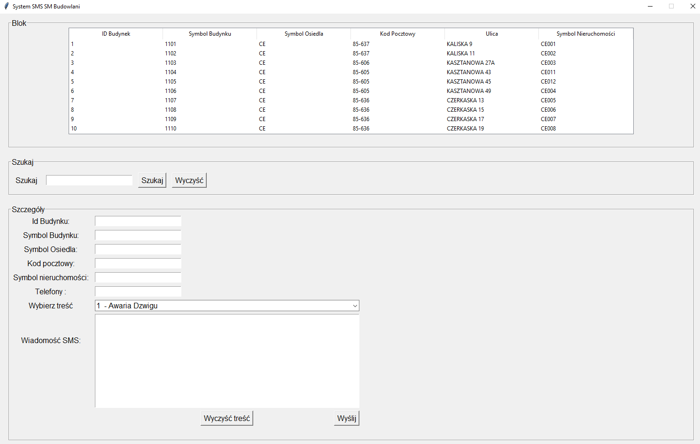

# Dillinger
## _The Last Markdown Editor, Ever_

# SM Budowlani
> Application for sending group SMS messages. It is used for one-way communication with the inhabitants of SM Budowlani resources.

## Table of contents
* [General info](#general-info)
* [Screenshots](#screenshots)
* [Technologies](#technologies)
* [Setup](#setup)
* [Features](#features)
* [Status](#status)
* [Inspiration](#inspiration)
* [Contact](#contact)

## General info
Application for sending group SMS messages. It is used for one-way communication with the inhabitants of SM Budowlani resources.
## Screenshots

## Technologies
* Python - version 3.8
* XAMP - version 3.2.4

## Setup
There are two versions for launch:
* EXE on Windows systems
* PY file to be run on any operating system after installing the Python interpreter 

## Code Examples
Show examples of usage:
`lbl4 = Label(window3, text="Kod pocztowy:", font=("bold", 12))
lbl4.grid(row=3, column=0, padx=5, pady=3)
ent4 = Entry(window3, textvariable=t4, font=("bold", 12))
ent4.grid(row=3, column=1, padx=5, pady=3, sticky=W)`

    lbl5 = Label(window3, text="Ulica:", font=("bold", 12))
    lbl5.grid(row=4, column=0, padx=5, pady=3)
    ent5 = Entry(window3, textvariable=t5, font=("bold", 12))
    ent5.grid(row=4, column=1, padx=5, pady=3, sticky=W)

## Features
List of features ready and TODOs for future development
* sending single SMS

To-do list:
* Try and Except in searching fields
* Textbox message

## Status
Project is: _in progress_, 

## Inspiration
Completely original project.

## Contact
Created by [@ithelparturgolata](ithelparturgolata@gmail.com) - feel free to contact me!